# 📒 Notes – A Minimal Yet Powerful Note-Taking App with AI & Cloud Sync

**Notes** is a Nothing-style themed, minimalist, and powerful note-taking Android app built using **Kotlin** and **Jetpack Compose**. It supports rich text, image blocks, speech-to-text AI integration, and full Firebase cloud sync — with everything neatly stored and beautifully presented.

---

📥 [Download APK](https://github.com/123thirumal/nothing_notes/releases/download/release/app-release.apk)

---

## ✨ Features

- 📝 Create structured notes with **text, lists, checklists, and images**
- 📷 Insert images from **camera or gallery**
- 🧠 **AI-powered speech-to-text** note creation
- ☁️ **Firebase Cloud Sync** to back up and access notes across devices
- 🔐 **Private Notes** section secured with **biometric/PIN**
- 🧱 Block-based content structure for intuitive editing
- 📴 Fully functional **offline** with local caching
- 🧑‍🎨 Clean, modern **Jetpack Compose** UI with Nothing-style design

---

## 📱 Screenshots

### 🏠 HOME

| 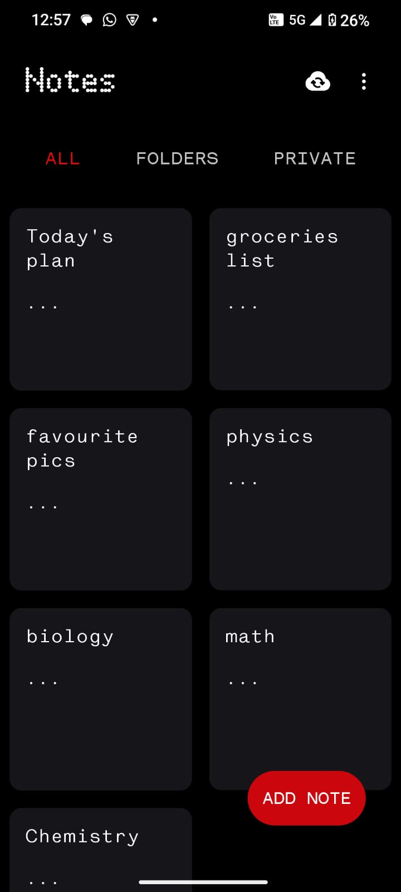 | 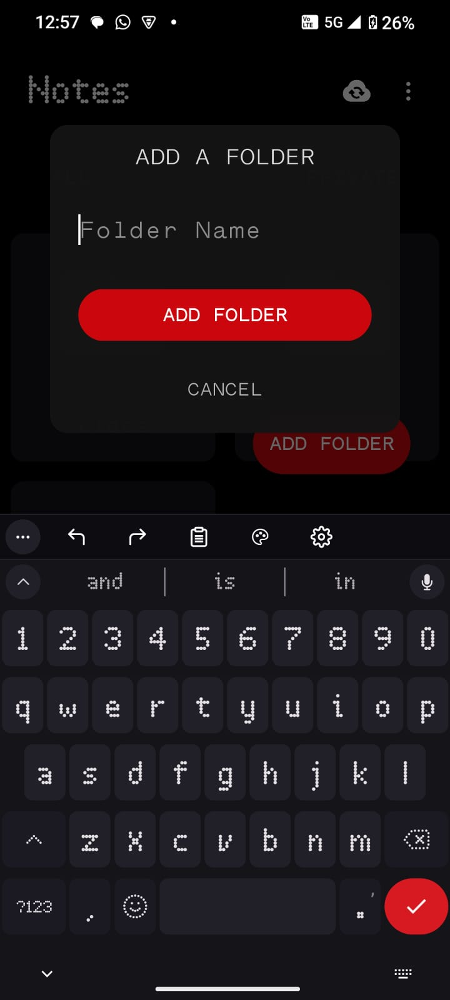 | 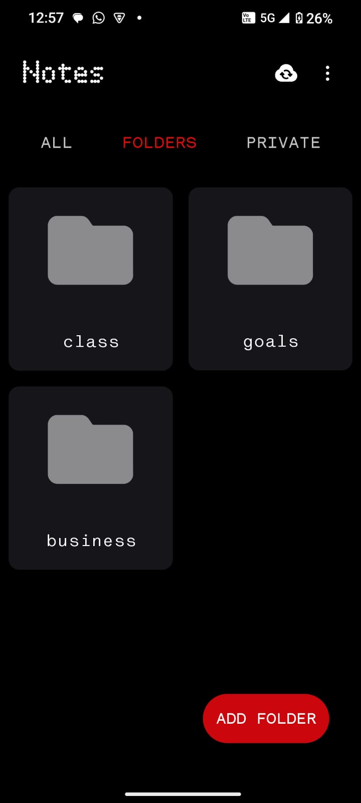 | 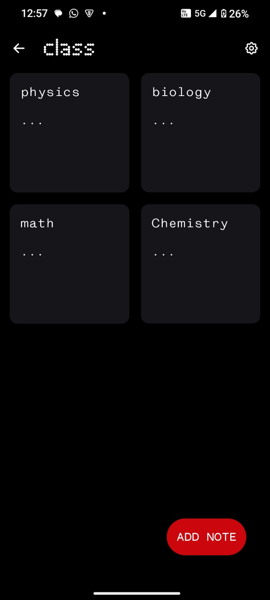 |
|--------------------------------|--------------------------------|--------------------------------|--------------------------------|

---


### 📝 NOTE EDITOR

| 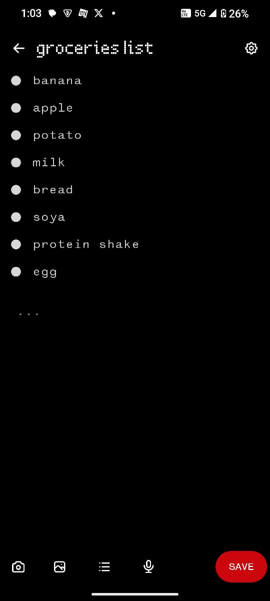 | 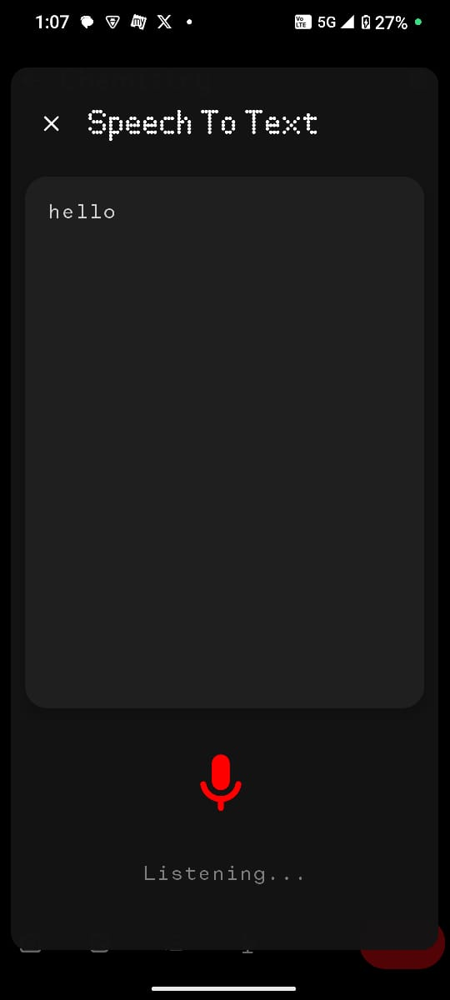 | 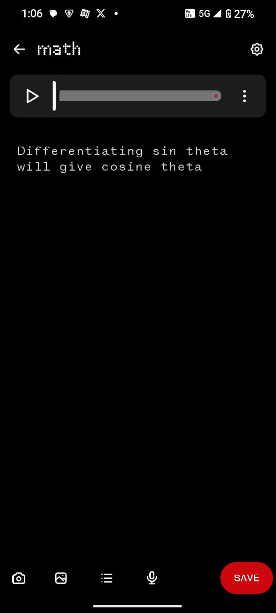 | 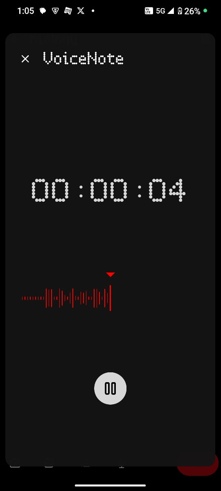 |
|----------------------------|----------------------------|----------------------------|----------------------------|


| 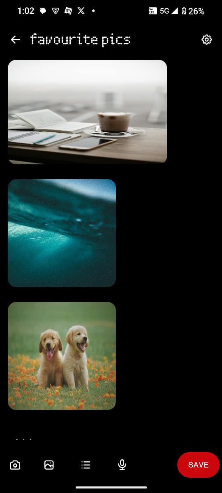 | 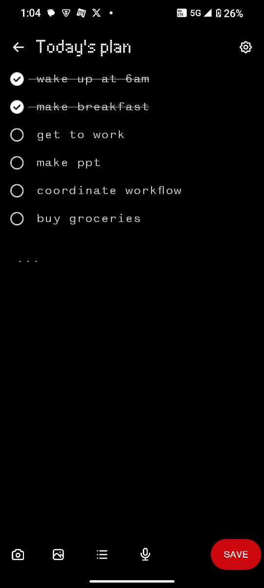 |                       |                       |
|----------------------------|----------------------------|----------------------------|----------------------------|

---

### 🔒 PRIVATE FILES

| 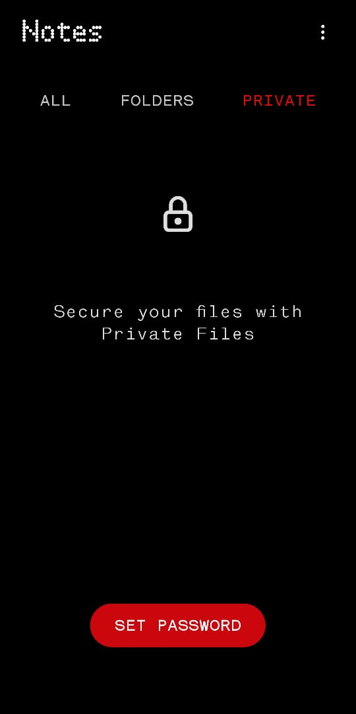 | 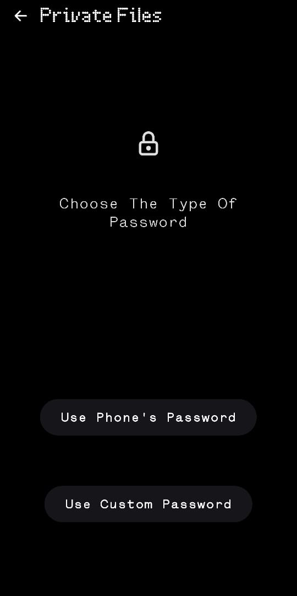 | 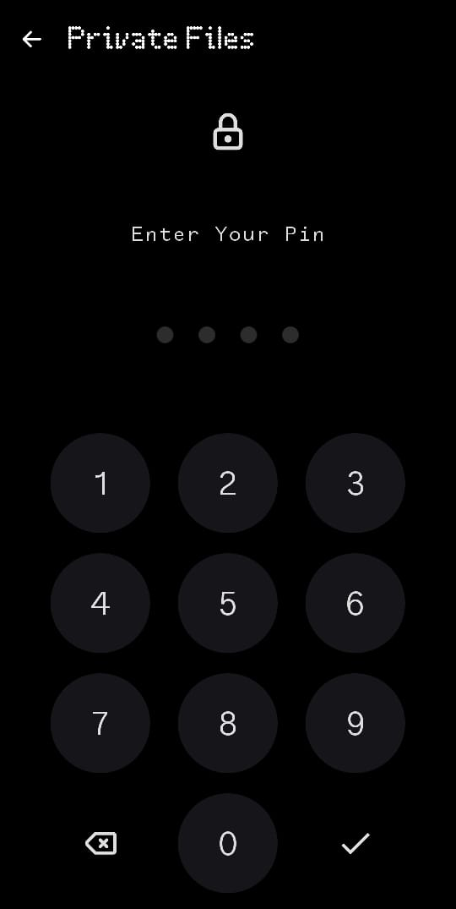 | 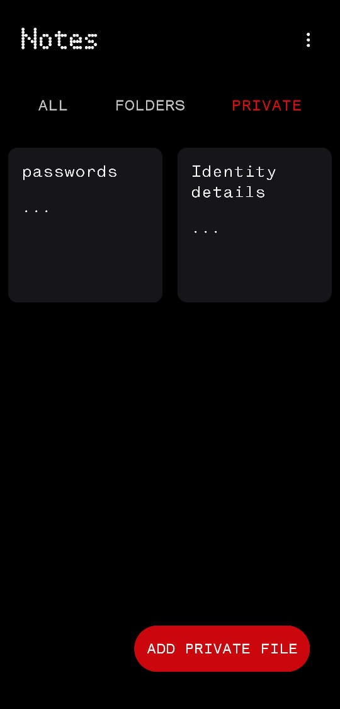 |
|----------------------------------------|----------------------------------------|----------------------------------------|----------------------------------------|

---


### 🔒 cloud

| 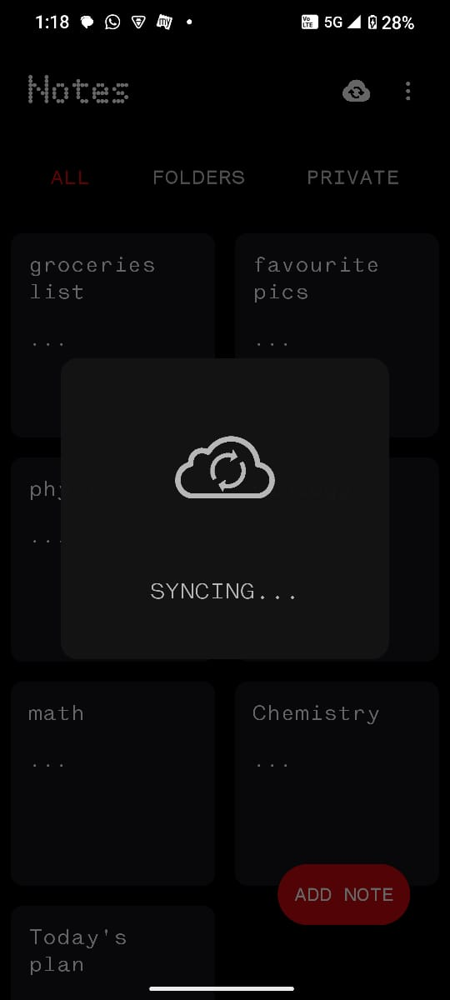 | 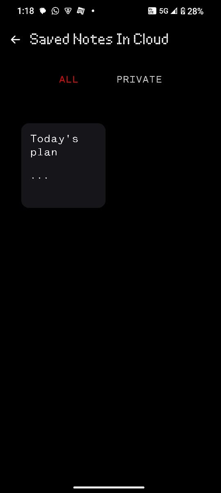 | 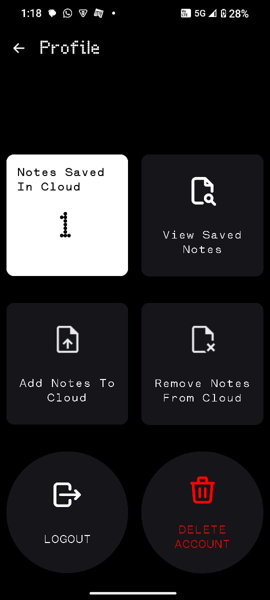 | 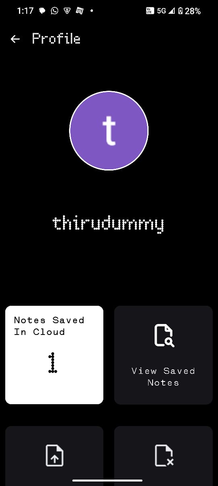 |
|-----------------------------|-----------------------------|-----------------------------|-----------------------------|

---
## 🚀 Getting Started

### 📦 Prerequisites

- Android Studio Electric Eel or newer
- Kotlin 1.8+
- Firebase project (Firestore, Storage, Auth)
- Min SDK 24+

---

### 📲 Installation

1. Clone the repo:
   ```bash
   git clone https://github.com/123thirumal/MyNotes.git
   cd MyNotes
