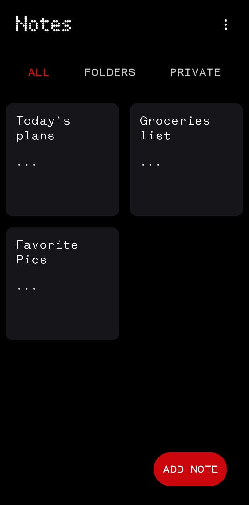
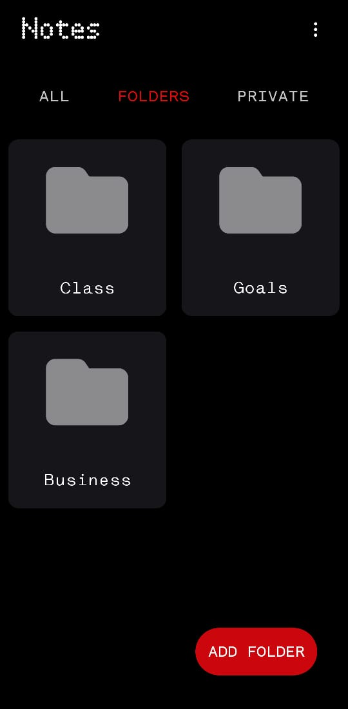
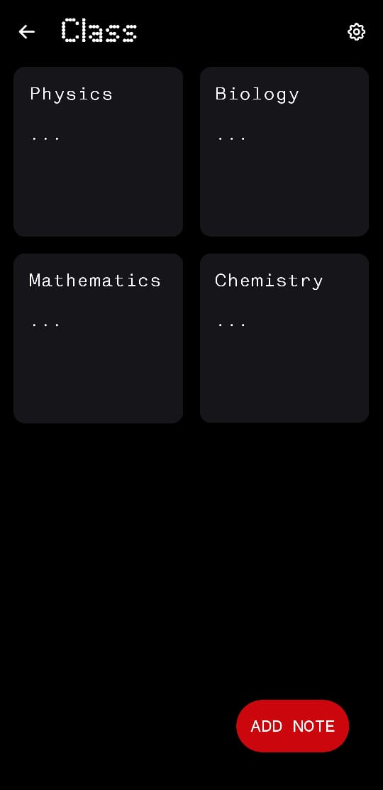
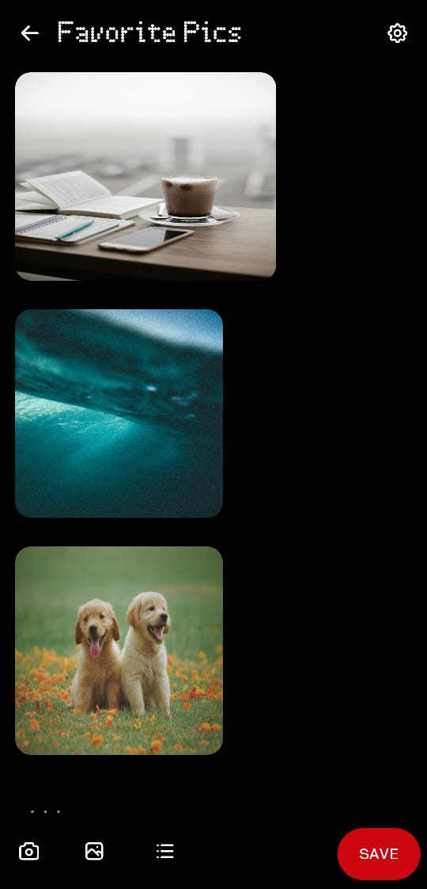
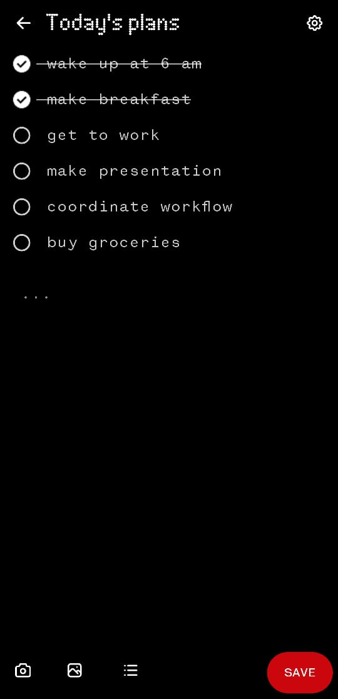
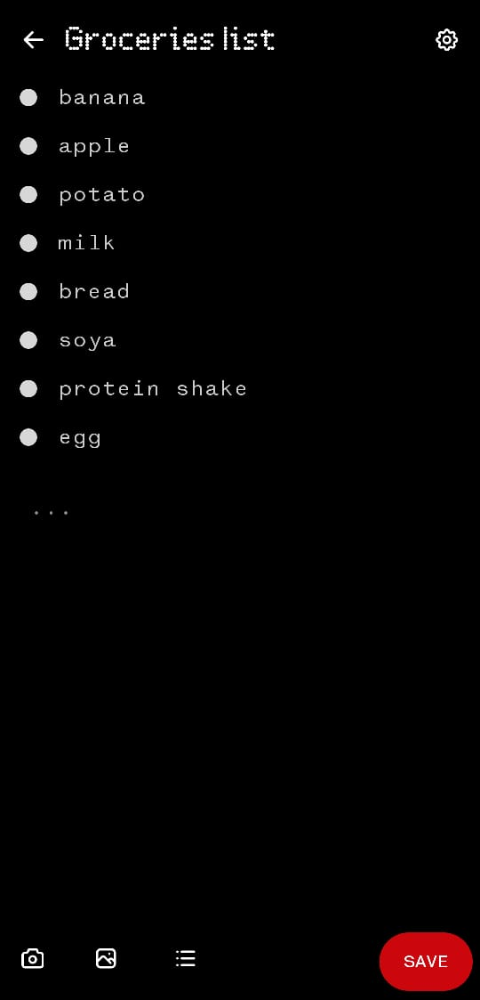
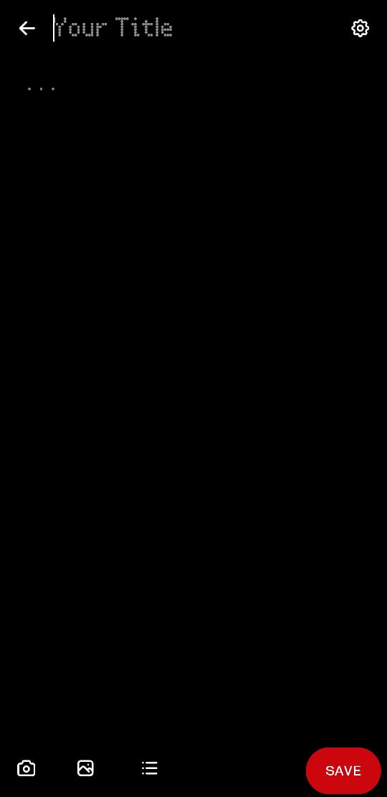

# 📒 Notes - A Nothing Style Themed Minimal Yet Powerful Note Taking App

Notes is a Nothing Style Themed and simple note-taking Android app built with Kotlin, Jetpack Compose. It supports text, image blocks, camera/gallery image insertion, and seamless editing – all stored safely in your device.

---

📥 [Download APK](https://github.com/123thirumal/nothing_notes/releases/download/v2.0.0/app-release.apk)

---

## ✨ Features

- 📝 Create rich notes with text and images
- 📷 Add photos directly using **camera or gallery**
- 📂 Organize and edit content in blocks
- 💾 Local storage only – no internet needed
- 🎨 Built using modern **Jetpack Compose**

---

## 📱 Screenshots

### 🏠 HOME 
| Home                                     |
|------------------------------------------|
|  |

---

### 📂 FOLDER
| Folder View 1                        | Folder View 2                        |
|--------------------------------------|--------------------------------------|
|  |  |

---

### 📝 NOTE EDITOR

| Image Block                                       | Checklist Block                                           | List Block                                      |
|---------------------------------------------------|-----------------------------------------------------------|-------------------------------------------------|
|  |  |  |

| Text Block                                      |
|-------------------------------------------------|
|  |


---

### 🔒 PRIVATE FILES
| Private File 1                         | Private File 2                         | Private File 3                         |
|----------------------------------------|----------------------------------------|----------------------------------------|
|  |  |  |
| Private File 4                         |                                  
| ----------------                       |                                  
|  |                                  

---

## 🚀 Getting Started

### 📦 Prerequisites

- Android Studio Electric Eel or above
- Kotlin 1.8+
- Min SDK 24+

### 📲 Installation

1. Clone the repo:
   ```bash
   git clone https://github.com/123thirumal/MyNotes.git
   cd MyNotes
